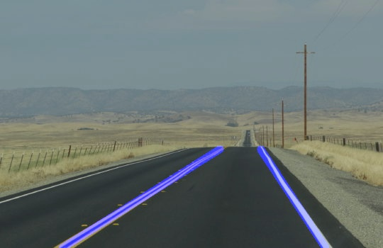
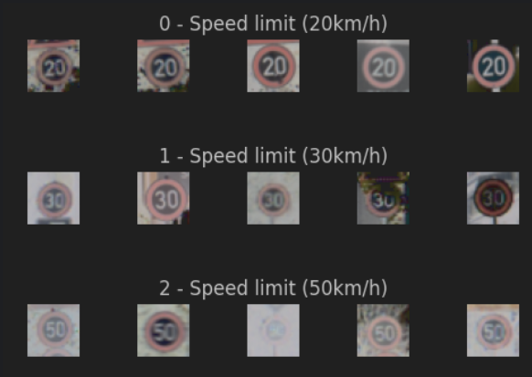
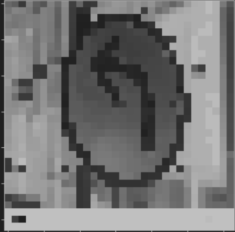

# NeuroDrive-self-driving-car

## Introduction

This project is a self-driving car simulation using a neural network. The neural network is trained using a behavioural cloning. The car is able to drive itself around a track using the trained neural network.

## Installation
1. Clone the repository
2. Install the required packages using `pip install -r requirements.txt`
3. Run the simulation using `python drive.py model.h5`

## Modules

### Detect lane lines
First step of self-driving is to find the lanes. This module uses OpenCV to detect the lanes.
An example of the detected lanes is shown below.

oad the simulator from [here](https://github.com/udacity/self-driving-car-sim) or use the provided dataset in the 

### Classify road signs
The second step is to classify the road signs. This module uses a convolutional neural network to classify the road signs. The neural network is trained using images of traffic signs. The neural network is trained using Keras and Tensorflow. The neural network is able to classify 43 different road signs.
#### Example images of the dataset:

#### Example of preprocessed image:

